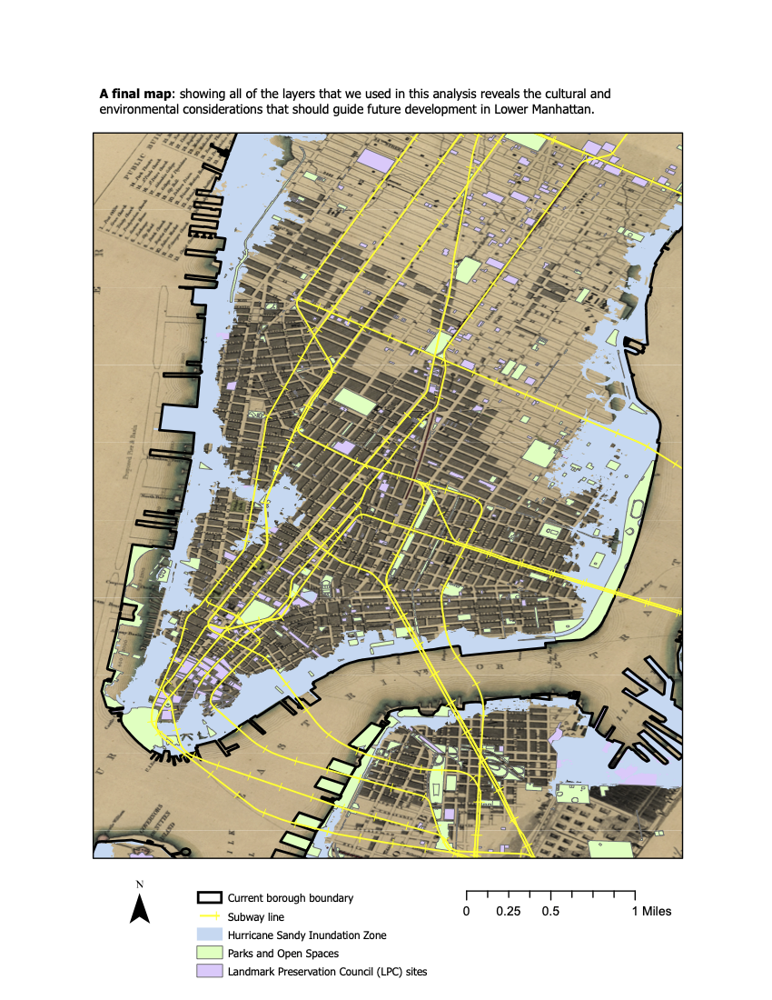
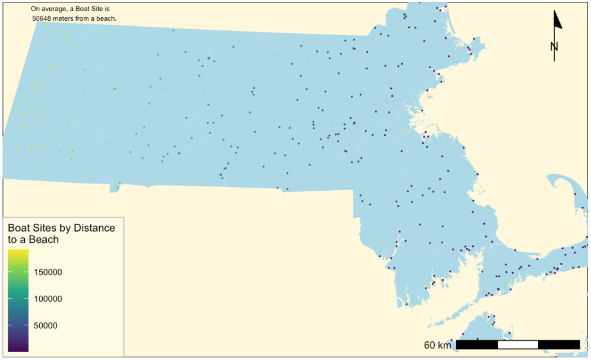
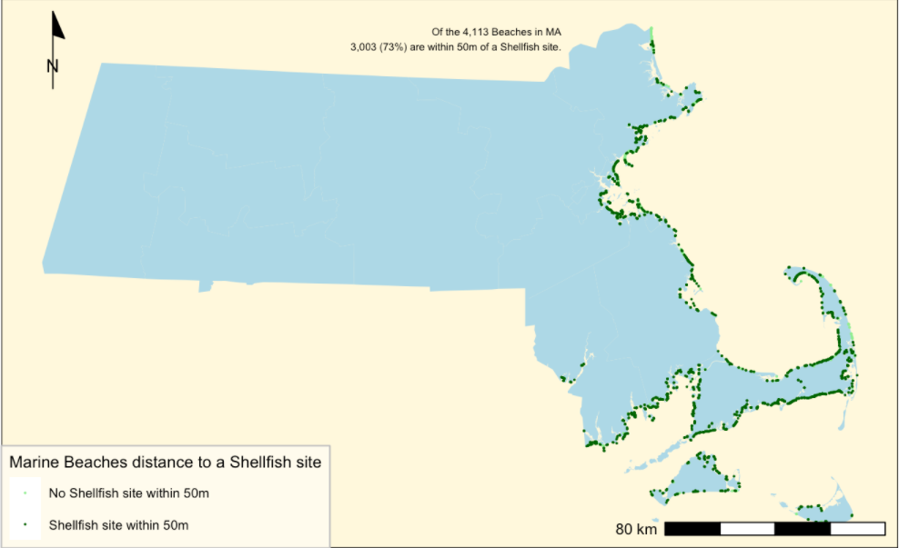
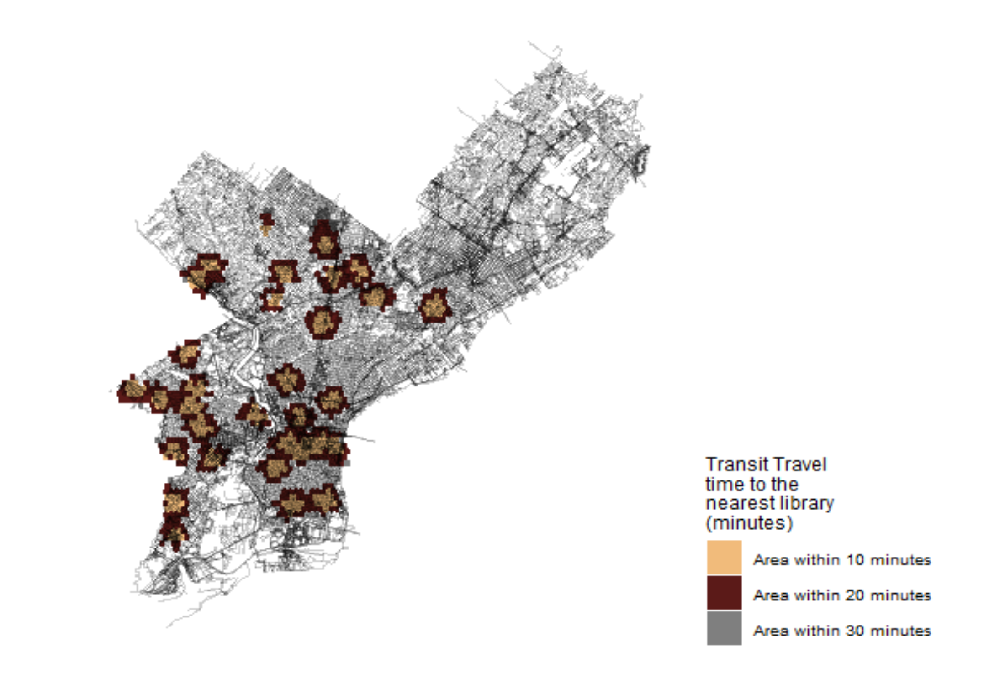
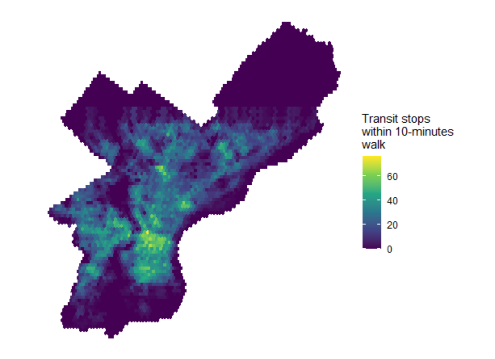
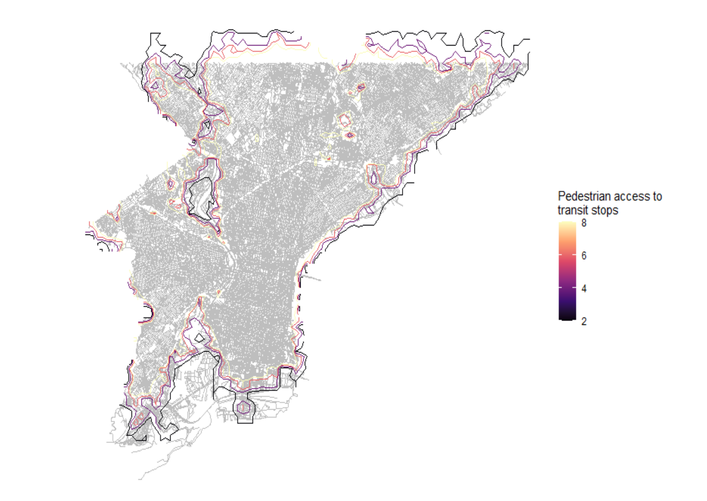
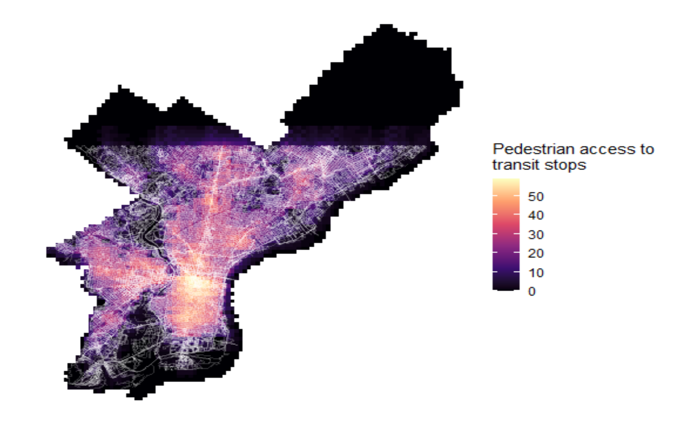
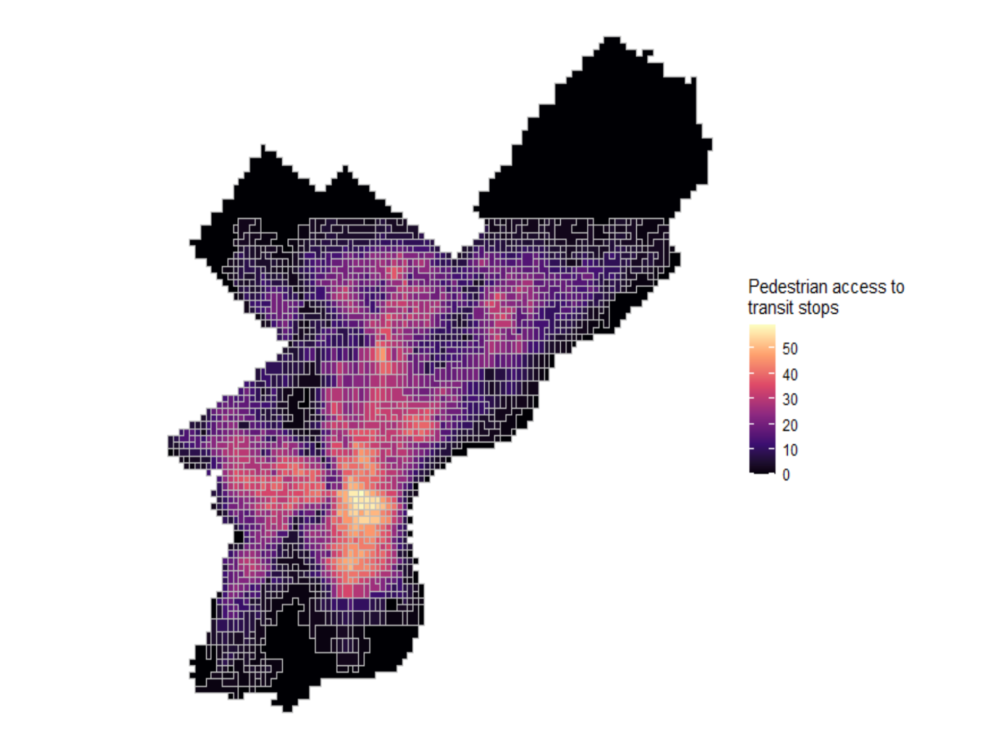
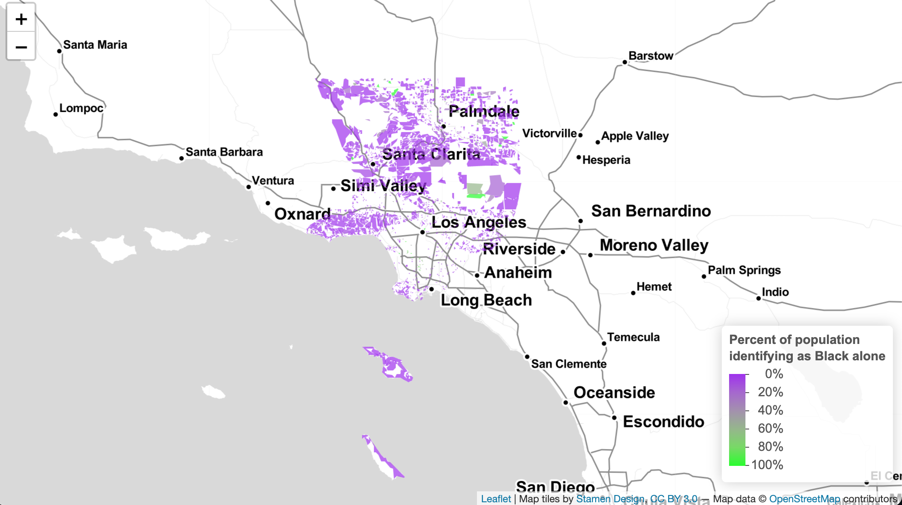

```{r setup, include=FALSE}
knitr::opts_chunk$set(echo = TRUE)
```

# Introduction
This portfolio is a compilation of all maps produced in the course VIS 2128: Spatial Analysis. These maps cover major metropolitan regions like New York City, Philadelphia, Los Angeles, and Chicago. There were a total of 6 assignments, and there are maps tied to every assignment from the course.


My portfolio demonstrates an understanding of the following skills taught during the course:

* Displaying multiple vector layers on the same map
* Calculating and displaying relationships among point and polygon layers based on distance
* Aggregating point data to a layer of polygons
* Calculating and displaying accessibility, based on travel time
* Converting between raster layers and vector layers
* Displaying raster data on a map
* Georeferencing a raster image
* Displaying data on an interactive map

# Map of Chicago 
This map shows the relationship between Enterprise Zones and transit stops in Chicago. This map demonstrates the following skiil:

* Displaying multiple point and polygon layers on the same map

[](https://jnabayan.github.io/Final-Portfolio/fullsize/assignment1.Pdf){target="_blank"}

# ArcGIS Map 
The assignment to create a georeferenced map with a layer of points was undertaken with New York City. This map demonstrates the following skill: 

* Georeferencing a raster image

[](https://jnabayan.github.io/Final-Portfolio/fullsize/NYC.pdf){target="_blank"}

# Map of Massachusetts 
This assignment shows the point and polygon relationships of marine beaches, boat docking sites, shellfish growing regions, and counties in Massachusetts. These maps demonstrate the following skills:

* Calculating and displaying relationships among point and polygon layers based on distance
* Aggregating point data to a layer of polygons

[](https://jnabayan.github.io/Final-Portfolio/fullsize/massmap1.Pdf){target="_blank"}

[](https://jnabayan.github.io/Final-Portfolio/fullsize/massmap2.Pdf){target="_blank"}

# Maps of Philadelphia 
This assignment displays data for transit and library accessibility in Philly. These maps demonstrate the following skills:

* Aggregating point data to a layer of polygons
* Calculating and displaying accessibility, based on travel time
* Converting between raster layers and vector layers
* Displaying raster data on a map
* Displaying multiple vector layers on the same map

[](https://jnabayan.github.io/Final-Portfolio/fullsize/phillymap2.Pdf){target="_blank"}

[](https://jnabayan.github.io/Final-Portfolio/fullsize/philly1.Pdf){target="_blank"}

[](https://jnabayan.github.io/Final-Portfolio/fullsize/phillymap3.Pdf){target="_blank"}

[](https://jnabayan.github.io/Final-Portfolio/fullsize/philly4.pdf){target="_blank"}

[](https://jnabayan.github.io/Final-Portfolio/fullsize/philly5.Pdf){target="_blank"}

[](https://jnabayan.github.io/Final-Portfolio/fullsize/philly6.pdf){target="_blank"}

# Interactive Map 
This assignment displays an interactive map of Black people living in Los Angeles. This map demonstrates the following skill:

* Displaying data on an interactive map

[](https://jnabayan.github.io/Final-Portfolio/fullsize/inter_black.html){target="_blank"}