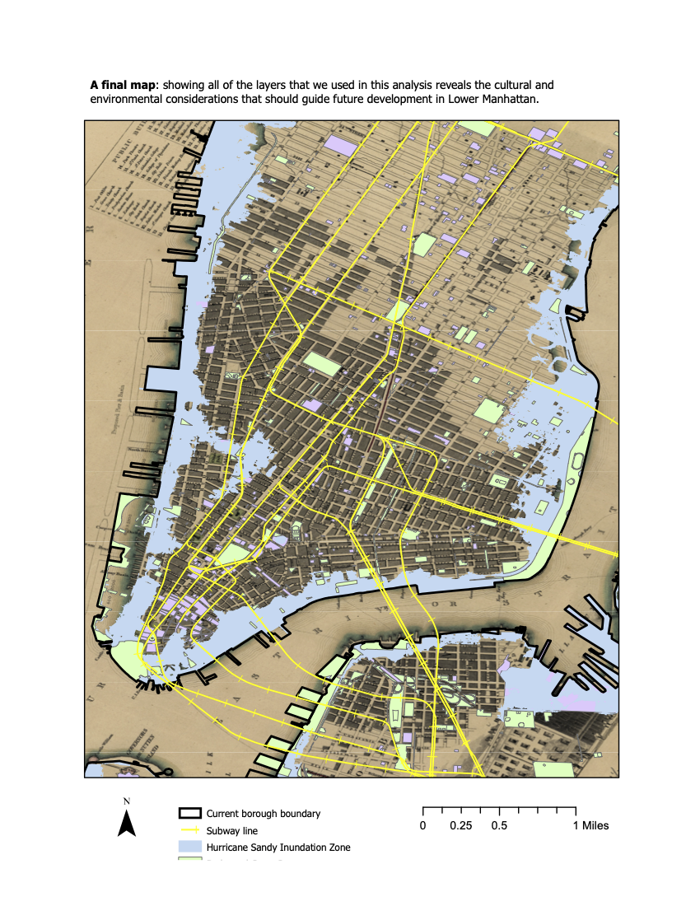
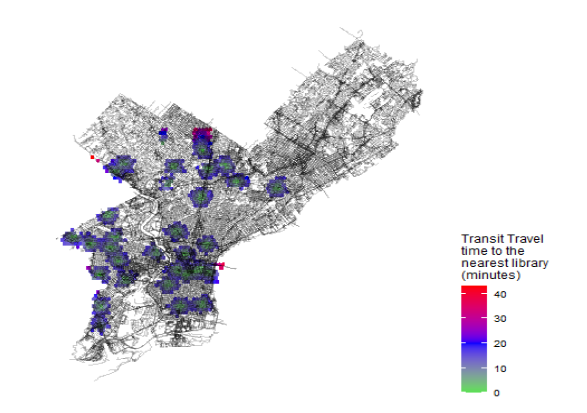

```{r setup, include=FALSE}
knitr::opts_chunk$set(echo = TRUE)
```

# Introduction
This is an example of a portfolio that someone might assemble to demonstrate the skills they have developed in VIS 2128. I have created this page using RMarkdown. There are fancier tools out there for creating and hosting webpages, and you are welcome to use any of those if you like. The advantage of this approach is that you can create your webpage directly from RStudio.


Your portfolio should demonstrate each of the following skills (not all of which are demonstrated in this example):

* Displaying multiple vector layers on the same map
* Calculating and displaying relationships among point and polygon layers based on distance
* Aggregating point data to a layer of polygons
* Calculating and displaying accessibility, based on travel time
* Converting between raster layers and vector layers
* Displaying raster data on a map
* Georeferencing a raster image
* Displaying data on an interactive map

# Map of Chicago (Assignment 1)
This map shows the relationship between Enterprise Zones and transit stops in Chicago. This map demonstrates the following skiil:

* Displaying multiple point and polygon layers on the same map

[](https://jnabayan.github.io/Final-Portfolio/fullsize/assignment1.pdf){target="_blank"}

## ArcGIS Map (Assignment 2)
The assignment to create a georeferenced map with a layer of points was undertaken with New York City. This map demonstrates the following skill: 

* Georeferencing a raster image

[](https://jnabayan.github.io/Final-Portfolio/fullsize/nycmap.pdf){target="_blank"}

## Map of Massachusetts (Assignment 3)
This assignment shows the point and polygon relationships of marine beaches, boat docking sites, shellfish growthing regions, and counties in Massachusetts. These maps demonstrate the following skills:

* Calculating and displaying relationships among point and polygon layers based on distance
* Aggregating point data to a layer of polygons

[](https://jnabayan.github.io/Final-Portfolio/fullsize/massmap1.pdf){target="_blank"}

[](https://jnabayan.github.io/Final-Portfolio/fullsize/massmap2.pdf){target="_blank"}

# Maps of Philadelphia (Assignment 4/5)
This assignment displays data for transit and library accessibility in Philly. These maps demonstrate the following skills:

* Aggregating point data to a layer of polygons
* Calculating and displaying accessibility, based on travel time
* Converting between raster layers and vector layers
* Displaying raster data on a map
* Displaying multiple vector layers on the same map

[](https://jnabayan.github.io/Final-Portfolio/fullsize/philly map 1.pdf){target="_blank"}

[](https://jnabayan.github.io/Final-Portfolio/fullsize/phillymap2.pdf){target="_blank"}

[](https://jnabayan.github.io/Final-Portfolio/fullsize/phillymap3.pdf){target="_blank"}

[](https://jnabayan.github.io/Final-Portfolio/fullsize/philly4.pdf){target="_blank"}

[](https://jnabayan.github.io/Final-Portfolio/fullsize/philly5.pdf){target="_blank"}

[](https://jnabayan.github.io/Final-Portfolio/fullsize/philly6.pdf){target="_blank"}

# Interactive Map (Assignment 6)
This assignment displays an interactive map of the Black population in Los Angeles. This map demonstrates the following skill:

* Displaying data on an interactive map

[](https://jnabayan.github.io/Final-Portfolio/fullsize/inter_black.html){target="_blank"}